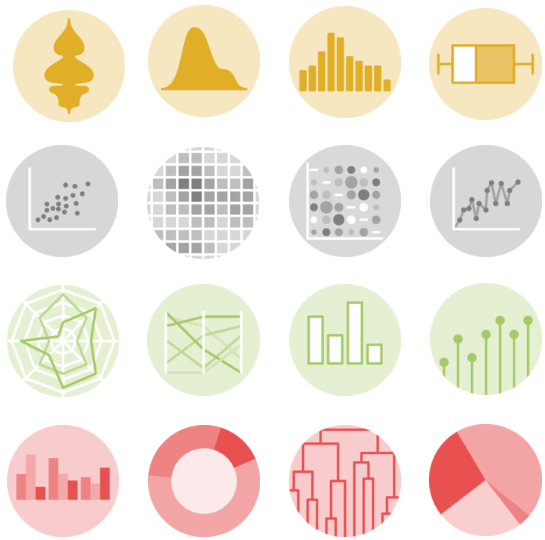
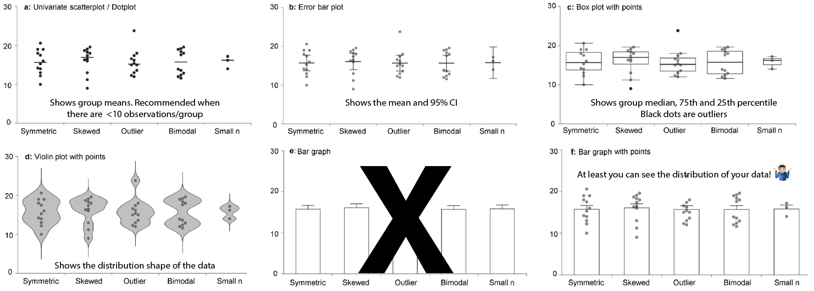
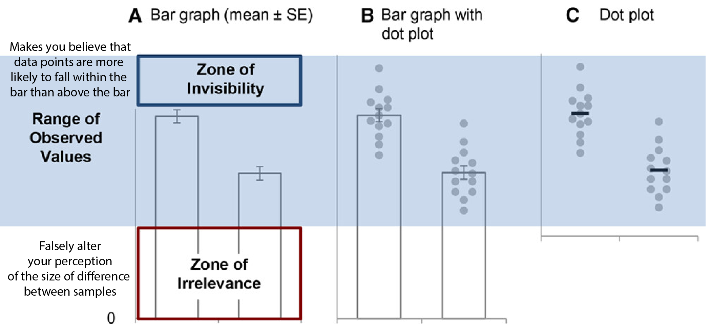
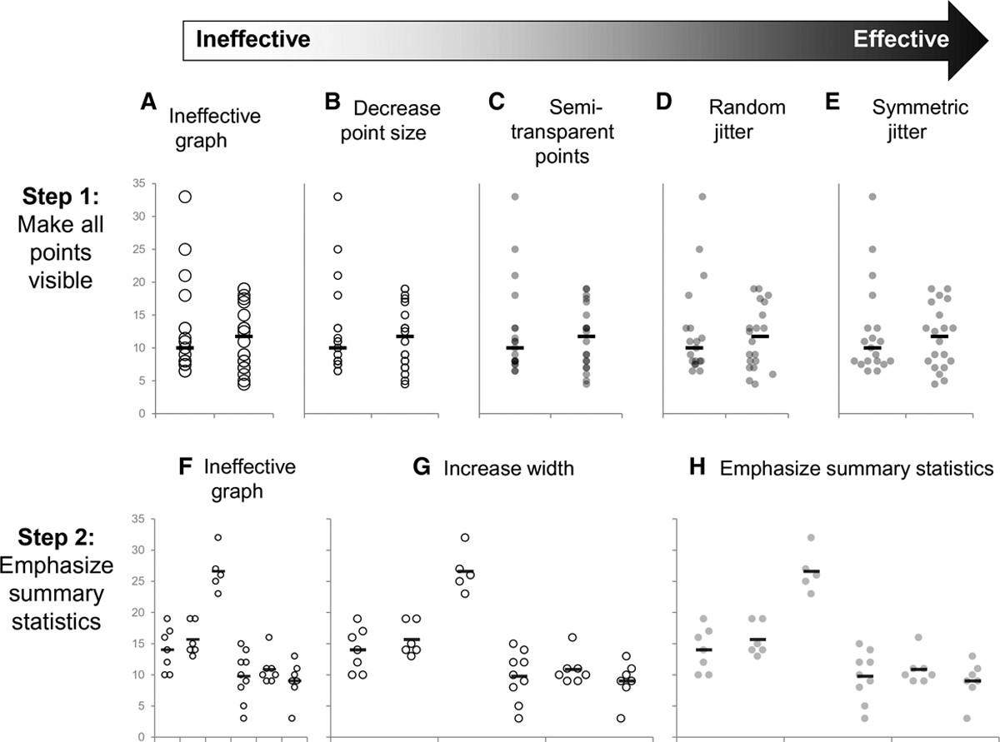
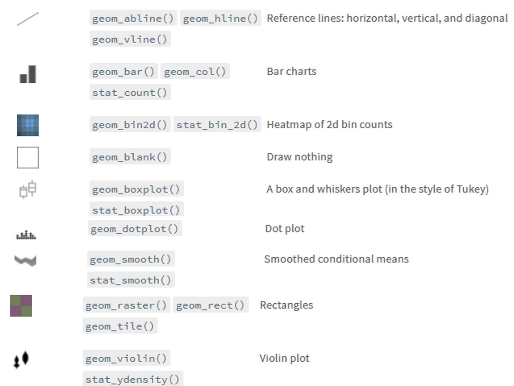

<h1><center>Making publication ready figures with ggpubr <br />
    Ahmet Bakirbas, Ph.D.<br />
    12/06/2024</center></h1>

## Before we start learning about the ggpubr package, let's remember a few key points about data visualization.

### 1. Different graphs emphasize different aspects of the data:



###### Modified from [Weissgerber et al. (2017)](https://www.jbc.org/article/S0021-9258(20)32792-7/fulltext) 

### 2. Why you should not use a bar graph:



### 3. Don't conceal your data:


###### Modified from [Matejka & Fitzmaurice (2017)](https://www.research.autodesk.com/publications/same-stats-different-graphs/) 
#### - Seven distributions of data, shown as raw data points (of strip-plots), as box plots, and as violin plots.
#### - Boxplots are commonly used to show the distribution of a dataset, and are better than simply showing the mean or median value. However, here we can see as the distribution of points changes, the box-plot remains static.
#### - Violin plots are good for presenting distribution of your data with more detail than it is available with a box plot.

### 4. Allow your PI/colleagues/readers to evaluate your data effectively:



###### Modified from [Weissgerber et al. (2019)](https://www.ahajournals.org/doi/10.1161/CIRCULATIONAHA.118.037777?url_ver=Z39.88-2003)

#### - Jittering is useful when you have a discrete position and a relatively small number of points.
#### - **Do not use** jitter when the exact location of a mark is important to the analysis.

### ggplot2 is a popular data visualization package developed by Hadley Wickham for programming langugage R
#### You can create highly customizable plots using ggplot2 package


### <ins> Grammar of ggplot2 </ins>

#### ggplot function accepts two arguments
##### - Dataset to be plotted (data.frame format)
##### - Aesthetic mappings provided by aes function

#### Additional parameters such as geometric objects (e.g. points, lines, bars) are passed on by appending them with + as separator.

#### Geoms: a layer combines data, aes, a geom (geometric object), a stat (statistical transformation), and a position adjustment. Typically, you will create layers using a geom_ function, overriding the default position and stat if needed.



### Let's familiarize ourselves with ggplot2 grammar:


```R
# We are using data from the National Morbidity and Mortality Air Pollution Study (NMMAPS).
# To make the plots manageable we are limiting the data to Chicago and 1997–2000.
chicago <- read_csv("https://cedricscherer.com/data/chicago-nmmaps-custom.csv")

#list top 10 rows
head(chicago, 10)
```

    
    -- Column specification --------------------------------------------------------
    cols(
      city = col_character(),
      date = col_date(format = ""),
      temp = col_double(),
      o3 = col_double(),
      dewpoint = col_double(),
      pm10 = col_double(),
      season = col_character(),
      yday = col_double(),
      month = col_character(),
      year = col_double()
    )
    
    
    


<table>
<caption>A tibble: 10 × 10</caption>
<thead>
	<tr><th scope=col>city</th><th scope=col>date</th><th scope=col>temp</th><th scope=col>o3</th><th scope=col>dewpoint</th><th scope=col>pm10</th><th scope=col>season</th><th scope=col>yday</th><th scope=col>month</th><th scope=col>year</th></tr>
	<tr><th scope=col>&lt;chr&gt;</th><th scope=col>&lt;date&gt;</th><th scope=col>&lt;dbl&gt;</th><th scope=col>&lt;dbl&gt;</th><th scope=col>&lt;dbl&gt;</th><th scope=col>&lt;dbl&gt;</th><th scope=col>&lt;chr&gt;</th><th scope=col>&lt;dbl&gt;</th><th scope=col>&lt;chr&gt;</th><th scope=col>&lt;dbl&gt;</th></tr>
</thead>
<tbody>
	<tr><td>chic</td><td>1997-01-01</td><td>36.0</td><td> 5.659256</td><td>37.500</td><td>13.052268</td><td>Winter</td><td> 1</td><td>Jan</td><td>1997</td></tr>
	<tr><td>chic</td><td>1997-01-02</td><td>45.0</td><td> 5.525417</td><td>47.250</td><td>41.948600</td><td>Winter</td><td> 2</td><td>Jan</td><td>1997</td></tr>
	<tr><td>chic</td><td>1997-01-03</td><td>40.0</td><td> 6.288548</td><td>38.000</td><td>27.041751</td><td>Winter</td><td> 3</td><td>Jan</td><td>1997</td></tr>
	<tr><td>chic</td><td>1997-01-04</td><td>51.5</td><td> 7.537758</td><td>45.500</td><td>25.072573</td><td>Winter</td><td> 4</td><td>Jan</td><td>1997</td></tr>
	<tr><td>chic</td><td>1997-01-05</td><td>27.0</td><td>20.760798</td><td>11.250</td><td>15.343121</td><td>Winter</td><td> 5</td><td>Jan</td><td>1997</td></tr>
	<tr><td>chic</td><td>1997-01-06</td><td>17.0</td><td>14.940874</td><td> 5.750</td><td> 9.364655</td><td>Winter</td><td> 6</td><td>Jan</td><td>1997</td></tr>
	<tr><td>chic</td><td>1997-01-07</td><td>16.0</td><td>11.920985</td><td> 7.000</td><td>20.228428</td><td>Winter</td><td> 7</td><td>Jan</td><td>1997</td></tr>
	<tr><td>chic</td><td>1997-01-08</td><td>19.0</td><td> 8.678477</td><td>17.750</td><td>33.134819</td><td>Winter</td><td> 8</td><td>Jan</td><td>1997</td></tr>
	<tr><td>chic</td><td>1997-01-09</td><td>26.0</td><td>13.355892</td><td>24.000</td><td>12.118381</td><td>Winter</td><td> 9</td><td>Jan</td><td>1997</td></tr>
	<tr><td>chic</td><td>1997-01-10</td><td>16.0</td><td>10.448264</td><td> 5.375</td><td>24.761534</td><td>Winter</td><td>10</td><td>Jan</td><td>1997</td></tr>
</tbody>
</table>


```R
g <- ggplot(chicago, aes(x = date, y = temp))
g
#only a white panel? Why? This is because {ggplot2} does not know how we want to plot that data
```


    

    


```R
g2 <- g + geom_point() #scatter plot
g2
g2 <- g + geom_line() #line plot

#let's have some fun
gcolor <- g + geom_point(color = "firebrick", shape = "diamond", size = 2)
gcolor

#let's change the theme for a more sophisticated look
gcolor2 <- gcolor + theme_set(theme_bw()) #black&white theme
gcolor2
g + geom_point(color = "firebrick")

#changing axis titles
gaxis <- ggplot(chicago, aes(x = date, y = temp)) +
  geom_point(color = "firebrick") +
  labs(x = "Year", y = "Temperature (°F)")
gaxis

#rotate axis text
grotate <- ggplot(chicago, aes(x = date, y = temp)) +
  geom_point(color = "firebrick") +
  labs(x = "Year", y = "Temperature (°F)") +
  theme(axis.text.x = element_text(angle = 50, vjust = 1, hjust = 1, size = 12))
grotate

#remove axis titles for a more simple look
ggplot(chicago, aes(x = date, y = temp)) +
  geom_point(color = "firebrick") +
  labs(x = NULL, y = "")

#add a title, subtitle, caption
glabs <- ggplot(chicago, aes(x = date, y = temp)) +
  geom_point(color = "firebrick") +
  labs(x = "Year", y = "Temperature (°F)",
       title = "Temperatures in Chicago",
       subtitle = "Seasonal pattern of daily temperatures from 1997 to 2001",
       caption = "Data: NMMAPS",
       tag = "Fig. 1")
glabs
#coloring the plot based on a category
gcolor <- ggplot(chicago,
       aes(x = date, y = temp, color = season)) +
  geom_point() +
  labs(x = "Year", y = "Temperature (°F)")
gcolor
#do you want to get rid of the legend?
gcolor <- ggplot(chicago,
       aes(x = date, y = temp, color = season)) +
  geom_point() +
  labs(x = "Year", y = "Temperature (°F)") +
  theme(legend.position = "bottom")
gcolor
```


    

    


    

    


    

    


    

    


    

    


    

    


    

    


    

    


    

    


    

    


### Create publication ready plots with ggpubr

#### - ggplot2 package is excellent and flexible for elegant data visualization in R.
#### - However the default generated plots requires some formatting before they can  be used in publications.


```R
install.packages("ggpubr")
```

    Installing package into 'C:/Users/Ahmet/Documents/R/win-library/3.6'
    (as 'lib' is unspecified)
    
    also installing the dependencies 'pillar', 'tibble', 'glue', 'rlang', 'scales', 'vctrs', 'cli', 'dplyr', 'lifecycle', 'purrr', 'stringr', 'tidyselect', 'broom', 'ggplot2', 'ggrepel', 'tidyr', 'rstatix'
    
    
    

    
      There are binary versions available but the source versions are later:
               binary source needs_compilation
    pillar      1.6.0  1.9.0             FALSE
    tibble      3.1.1  3.2.1              TRUE
    glue        1.4.2  1.6.2              TRUE
    rlang      0.4.11  1.1.2              TRUE
    scales      1.1.1  1.3.0              TRUE
    vctrs       0.3.8  0.6.5              TRUE
    cli         2.5.0  3.6.1              TRUE
    dplyr       1.0.6  1.1.4              TRUE
    lifecycle   1.0.0  1.0.4             FALSE
    purrr       0.3.4  1.0.2              TRUE
    stringr     1.4.0  1.5.1             FALSE
    tidyselect  1.1.1  1.2.0             FALSE
    broom       0.7.6  1.0.5             FALSE
    ggplot2     3.3.3  3.4.4             FALSE
    ggrepel     0.9.1  0.9.4              TRUE
    tidyr       1.1.3  1.3.0              TRUE
    rstatix     0.7.0  0.7.2             FALSE
    ggpubr      0.4.0  0.6.0             FALSE
    
      Binaries will be installed
    

    Warning message:
    "package 'vctrs' is in use and will not be installed"
    

    package 'tibble' successfully unpacked and MD5 sums checked
    

    Warning message:
    "cannot remove prior installation of package 'tibble'"
    Warning message in file.copy(savedcopy, lib, recursive = TRUE):
    "problem copying C:\Users\Ahmet\Documents\R\win-library\3.6\00LOCK\tibble\libs\x64\tibble.dll to C:\Users\Ahmet\Documents\R\win-library\3.6\tibble\libs\x64\tibble.dll: Permission denied"
    Warning message:
    "restored 'tibble'"
    

    package 'glue' successfully unpacked and MD5 sums checked
    

    Warning message:
    "cannot remove prior installation of package 'glue'"
    Warning message in file.copy(savedcopy, lib, recursive = TRUE):
    "problem copying C:\Users\Ahmet\Documents\R\win-library\3.6\00LOCK\glue\libs\x64\glue.dll to C:\Users\Ahmet\Documents\R\win-library\3.6\glue\libs\x64\glue.dll: Permission denied"
    Warning message:
    "restored 'glue'"
    

    package 'rlang' successfully unpacked and MD5 sums checked
    

    Warning message:
    "cannot remove prior installation of package 'rlang'"
    Warning message in file.copy(savedcopy, lib, recursive = TRUE):
    "problem copying C:\Users\Ahmet\Documents\R\win-library\3.6\00LOCK\rlang\libs\x64\rlang.dll to C:\Users\Ahmet\Documents\R\win-library\3.6\rlang\libs\x64\rlang.dll: Permission denied"
    Warning message:
    "restored 'rlang'"
    

    package 'scales' successfully unpacked and MD5 sums checked
    package 'cli' successfully unpacked and MD5 sums checked
    package 'dplyr' successfully unpacked and MD5 sums checked
    package 'purrr' successfully unpacked and MD5 sums checked
    package 'ggrepel' successfully unpacked and MD5 sums checked
    package 'tidyr' successfully unpacked and MD5 sums checked
    
    The downloaded binary packages are in
    	C:\Users\Ahmet\AppData\Local\Temp\RtmpeWhPP5\downloaded_packages
    

    installing the source packages 'pillar', 'lifecycle', 'stringr', 'tidyselect', 'broom', 'ggplot2', 'rstatix', 'ggpubr'
    
    
    Warning message in install.packages("ggpubr"):
    "installation of package 'lifecycle' had non-zero exit status"
    Warning message in install.packages("ggpubr"):
    "installation of package 'pillar' had non-zero exit status"
    Warning message in install.packages("ggpubr"):
    "installation of package 'stringr' had non-zero exit status"
    Warning message in install.packages("ggpubr"):
    "installation of package 'tidyselect' had non-zero exit status"
    Warning message in install.packages("ggpubr"):
    "installation of package 'ggplot2' had non-zero exit status"
    Warning message in install.packages("ggpubr"):
    "installation of package 'broom' had non-zero exit status"
    Warning message in install.packages("ggpubr"):
    "installation of package 'rstatix' had non-zero exit status"
    Warning message in install.packages("ggpubr"):
    "installation of package 'ggpubr' had non-zero exit status"
    


```R
library(ggpubr)
```

    Warning message:
    "package 'ggpubr' was built under R version 4.0.2"
    Warning message in read.dcf(file.path(p, "DESCRIPTION"), c("Package", "Version")):
    "cannot open compressed file 'C:/Users/Ahmet/Documents/R/win-library/3.6/ggplot2/DESCRIPTION', probable reason 'No such file or directory'"
    


    Error: package or namespace load failed for 'ggpubr' in loadNamespace(i, c(lib.loc, .libPaths()), versionCheck = vI[[i]]):
     namespace 'rlang' 0.4.6 is already loaded, but >= 0.4.10 is required
    Traceback:
    

    1. library(ggpubr)

    2. tryCatch({
     .     attr(package, "LibPath") <- which.lib.loc
     .     ns <- loadNamespace(package, lib.loc)
     .     env <- attachNamespace(ns, pos = pos, deps, exclude, include.only)
     . }, error = function(e) {
     .     P <- if (!is.null(cc <- conditionCall(e))) 
     .         paste(" in", deparse(cc)[1L])
     .     else ""
     .     msg <- gettextf("package or namespace load failed for %s%s:\n %s", 
     .         sQuote(package), P, conditionMessage(e))
     .     if (logical.return) 
     .         message(paste("Error:", msg), domain = NA)
     .     else stop(msg, call. = FALSE, domain = NA)
     . })

    3. tryCatchList(expr, classes, parentenv, handlers)

    4. tryCatchOne(expr, names, parentenv, handlers[[1L]])

    5. value[[3L]](cond)

    6. stop(msg, call. = FALSE, domain = NA)


```R
# Install the main RTCGA package 
if (!require("BiocManager", quietly = TRUE))
    install.packages("BiocManager")

BiocManager::install("RTCGA")
# Install the clinical and mRNA gene expression data packages 
BiocManager::install("RTCGA.clinical") 
BiocManager::install("RTCGA.mRNA")
#To see the type of data available for each cancer type, use this:
library(RTCGA) 
infoTCGA() 

```

    Bioconductor version 3.10 (BiocManager 1.30.10), R 3.6.1 (2019-07-05)
    
    Installing package(s) 'RTCGA'
    
    

    package 'RTCGA' successfully unpacked and MD5 sums checked
    
    The downloaded binary packages are in
    	C:\Users\Ahmet\AppData\Local\Temp\RtmpeWhPP5\downloaded_packages
    

    Old packages: 'acepack', 'afex', 'animation', 'ashr', 'askpass', 'babynames',
      'backports', 'BayesFactor', 'bayestestR', 'bbmle', 'bdsmatrix', 'BH',
      'BiocManager', 'biomartr', 'bit', 'bit64', 'bitops', 'blob', 'brew',
      'bridgesampling', 'Brobdingnag', 'broom', 'broom.mixed', 'BWStest', 'cachem',
      'callr', 'car', 'carData', 'caTools', 'checkmate', 'cli', 'clipr', 'coda',
      'coin', 'colorspace', 'colourpicker', 'commonmark', 'correlation',
      'corrplot', 'covr', 'crayon', 'crosstalk', 'cubature', 'cubelyr', 'curl',
      'data.table', 'dataCompareR', 'DEoptimR', 'desc', 'deSolve', 'devtools',
      'dichromat', 'digest', 'doParallel', 'dplR', 'dplyr', 'DT', 'effectsize',
      'ellipse', 'ellipsis', 'emdbook', 'EMT', 'enrichR', 'estimability',
      'europepmc', 'evaluate', 'exactRankTests', 'expm', 'fansi', 'farver',
      'fastGHQuad', 'fastmap', 'fastmatch', 'fdrtool', 'forcats', 'foreach',
      'formatR', 'formattable', 'Formula', 'fs', 'gapminder', 'gdata', 'gee',
      'generics', 'GGally', 'ggcorrplot', 'ggExtra', 'ggforce', 'ggfortify',
      'ggimage', 'ggplotify', 'ggpubr', 'ggraph', 'ggrepel', 'ggridges', 'ggsci',
      'ggsignif', 'ggthemes', 'gh', 'glue', 'gmp', 'gnm', 'GPArotation', 'gplots',
      'graphlayouts', 'gridGraphics', 'gridtext', 'grImport', 'gtable', 'gtools',
      'haven', 'hexbin', 'hexSticker', 'highr', 'Hmisc', 'htmltools',
      'htmlwidgets', 'httpuv', 'hwriter', 'igraph', 'inline', 'insight',
      'installr', 'isoband', 'iterators', 'jmv', 'jmvcore', 'jpeg', 'jsonlite',
      'kableExtra', 'knitr', 'kSamples', 'labeling', 'LaplacesDemon', 'later',
      'latticeExtra', 'lavaan', 'lessR', 'libcoin', 'lifecycle', 'lme4',
      'lmerTest', 'lmtest', 'logspline', 'loo', 'lubridate', 'magick', 'magrittr',
      'mapproj', 'maps', 'markdown', 'MatrixModels', 'matrixStats', 'mc2d',
      'metaplus', 'mime', 'minqa', 'mixsqp', 'mnormt', 'multcomp', 'multcompView',
      'mvtnorm', 'nloptr', 'nycflights13', 'openssl', 'openxlsx', 'paletteer',
      'palr', 'pals', 'parameters', 'pbapply', 'performance', 'philentropy',
      'pkgbuild', 'pkgload', 'plotrix', 'plyr', 'PMCMR', 'PMCMRplus', 'png',
      'polyclip', 'polynom', 'pracma', 'prettyunits', 'prismatic', 'processx',
      'proftools', 'promises', 'ps', 'pscl', 'psych', 'purrr', 'qap', 'qdapRegex',
      'quantreg', 'qvcalc', 'R.cache', 'R.methodsS3', 'R.oo', 'R.utils', 'R6',
      'ragg', 'rappdirs', 'rcmdcheck', 'RColorBrewer', 'Rcpp', 'RcppArmadillo',
      'RcppEigen', 'RcppNumerical', 'RcppParallel', 'RCurl', 'readr', 'readxl',
      'reldist', 'rematch', 'remotes', 'repr', 'reprex', 'reshape', 'rex', 'rio',
      'rlang', 'rmarkdown', 'Rmpfr', 'robustbase', 'roxygen2', 'rprojroot',
      'RSQLite', 'rstan', 'rstantools', 'rstatix', 'rvcheck', 'rversions', 'rvest',
      'sandwich', 'sas7bdat', 'sass', 'scales', 'seriation', 'sessioninfo',
      'shinyjs', 'showtext', 'showtextdb', 'signal', 'sjlabelled', 'sjmisc',
      'sjstats', 'skimr', 'slam', 'snow', 'sourcetools', 'sp', 'SparseM',
      'SQUAREM', 'StanHeaders', 'stargazer', 'statmod', 'stringi', 'styler',
      'SuppDists', 'survey', 'survival', 'sys', 'sysfonts', 'systemfonts', 'tab',
      'testthat', 'textshaping', 'TH.data', 'tibble', 'tidygraph', 'tidyr',
      'timechange', 'tinytex', 'TMB', 'triangle', 'triebeard', 'truncnorm', 'TSP',
      'tweenr', 'tzdb', 'usethis', 'utf8', 'vcd', 'vcdExtra', 'vegan', 'viridis',
      'viridisLite', 'vroom', 'webshot', 'wesanderson', 'whisker', 'writexl',
      'xfun', 'xml2', 'yaml', 'zip', 'zoo', 'boot', 'caret', 'class', 'cluster',
      'codetools', 'DBI', 'dbplyr', 'ggplot2', 'glmnet', 'gower', 'hms', 'httr',
      'ipred', 'IRdisplay', 'IRkernel', 'KernSmooth', 'lava', 'Matrix', 'mgcv',
      'ModelMetrics', 'modelr', 'nlme', 'nnet', 'numDeriv', 'pbdZMQ', 'pillar',
      'pkgconfig', 'prodlim', 'progress', 'quantmod', 'recipes', 'reshape2',
      'rpart', 'rstudioapi', 'selectr', 'shiny', 'spatial', 'stringr',
      'tidyselect', 'tidyverse', 'timeDate', 'TTR', 'uuid', 'withr', 'xts'
    
    Bioconductor version 3.10 (BiocManager 1.30.10), R 3.6.1 (2019-07-05)
    
    Installing package(s) 'RTCGA.clinical'
    
    installing the source package 'RTCGA.clinical'
    
    
    Warning message in install.packages(...):
    "installation of package 'RTCGA.clinical' had non-zero exit status"
    Old packages: 'acepack', 'afex', 'animation', 'ashr', 'askpass', 'babynames',
      'backports', 'BayesFactor', 'bayestestR', 'bbmle', 'bdsmatrix', 'BH',
      'BiocManager', 'biomartr', 'bit', 'bit64', 'bitops', 'blob', 'brew',
      'bridgesampling', 'Brobdingnag', 'broom', 'broom.mixed', 'BWStest', 'cachem',
      'callr', 'car', 'carData', 'caTools', 'checkmate', 'cli', 'clipr', 'coda',
      'coin', 'colorspace', 'colourpicker', 'commonmark', 'correlation',
      'corrplot', 'covr', 'crayon', 'crosstalk', 'cubature', 'cubelyr', 'curl',
      'data.table', 'dataCompareR', 'DEoptimR', 'desc', 'deSolve', 'devtools',
      'dichromat', 'digest', 'doParallel', 'dplR', 'dplyr', 'DT', 'effectsize',
      'ellipse', 'ellipsis', 'emdbook', 'EMT', 'enrichR', 'estimability',
      'europepmc', 'evaluate', 'exactRankTests', 'expm', 'fansi', 'farver',
      'fastGHQuad', 'fastmap', 'fastmatch', 'fdrtool', 'forcats', 'foreach',
      'formatR', 'formattable', 'Formula', 'fs', 'gapminder', 'gdata', 'gee',
      'generics', 'GGally', 'ggcorrplot', 'ggExtra', 'ggforce', 'ggfortify',
      'ggimage', 'ggplotify', 'ggpubr', 'ggraph', 'ggrepel', 'ggridges', 'ggsci',
      'ggsignif', 'ggthemes', 'gh', 'glue', 'gmp', 'gnm', 'GPArotation', 'gplots',
      'graphlayouts', 'gridGraphics', 'gridtext', 'grImport', 'gtable', 'gtools',
      'haven', 'hexbin', 'hexSticker', 'highr', 'Hmisc', 'htmltools',
      'htmlwidgets', 'httpuv', 'hwriter', 'igraph', 'inline', 'insight',
      'installr', 'isoband', 'iterators', 'jmv', 'jmvcore', 'jpeg', 'jsonlite',
      'kableExtra', 'knitr', 'kSamples', 'labeling', 'LaplacesDemon', 'later',
      'latticeExtra', 'lavaan', 'lessR', 'libcoin', 'lifecycle', 'lme4',
      'lmerTest', 'lmtest', 'logspline', 'loo', 'lubridate', 'magick', 'magrittr',
      'mapproj', 'maps', 'markdown', 'MatrixModels', 'matrixStats', 'mc2d',
      'metaplus', 'mime', 'minqa', 'mixsqp', 'mnormt', 'multcomp', 'multcompView',
      'mvtnorm', 'nloptr', 'nycflights13', 'openssl', 'openxlsx', 'paletteer',
      'palr', 'pals', 'parameters', 'pbapply', 'performance', 'philentropy',
      'pkgbuild', 'pkgload', 'plotrix', 'plyr', 'PMCMR', 'PMCMRplus', 'png',
      'polyclip', 'polynom', 'pracma', 'prettyunits', 'prismatic', 'processx',
      'proftools', 'promises', 'ps', 'pscl', 'psych', 'purrr', 'qap', 'qdapRegex',
      'quantreg', 'qvcalc', 'R.cache', 'R.methodsS3', 'R.oo', 'R.utils', 'R6',
      'ragg', 'rappdirs', 'rcmdcheck', 'RColorBrewer', 'Rcpp', 'RcppArmadillo',
      'RcppEigen', 'RcppNumerical', 'RcppParallel', 'RCurl', 'readr', 'readxl',
      'reldist', 'rematch', 'remotes', 'repr', 'reprex', 'reshape', 'rex', 'rio',
      'rlang', 'rmarkdown', 'Rmpfr', 'robustbase', 'roxygen2', 'rprojroot',
      'RSQLite', 'rstan', 'rstantools', 'rstatix', 'rvcheck', 'rversions', 'rvest',
      'sandwich', 'sas7bdat', 'sass', 'scales', 'seriation', 'sessioninfo',
      'shinyjs', 'showtext', 'showtextdb', 'signal', 'sjlabelled', 'sjmisc',
      'sjstats', 'skimr', 'slam', 'snow', 'sourcetools', 'sp', 'SparseM',
      'SQUAREM', 'StanHeaders', 'stargazer', 'statmod', 'stringi', 'styler',
      'SuppDists', 'survey', 'survival', 'sys', 'sysfonts', 'systemfonts', 'tab',
      'testthat', 'textshaping', 'TH.data', 'tibble', 'tidygraph', 'tidyr',
      'timechange', 'tinytex', 'TMB', 'triangle', 'triebeard', 'truncnorm', 'TSP',
      'tweenr', 'tzdb', 'usethis', 'utf8', 'vcd', 'vcdExtra', 'vegan', 'viridis',
      'viridisLite', 'vroom', 'webshot', 'wesanderson', 'whisker', 'writexl',
      'xfun', 'xml2', 'yaml', 'zip', 'zoo', 'boot', 'caret', 'class', 'cluster',
      'codetools', 'DBI', 'dbplyr', 'ggplot2', 'glmnet', 'gower', 'hms', 'httr',
      'ipred', 'IRdisplay', 'IRkernel', 'KernSmooth', 'lava', 'Matrix', 'mgcv',
      'ModelMetrics', 'modelr', 'nlme', 'nnet', 'numDeriv', 'pbdZMQ', 'pillar',
      'pkgconfig', 'prodlim', 'progress', 'quantmod', 'recipes', 'reshape2',
      'rpart', 'rstudioapi', 'selectr', 'shiny', 'spatial', 'stringr',
      'tidyselect', 'tidyverse', 'timeDate', 'TTR', 'uuid', 'withr', 'xts'
    
    Bioconductor version 3.10 (BiocManager 1.30.10), R 3.6.1 (2019-07-05)
    
    Installing package(s) 'RTCGA.mRNA'
    
    installing the source package 'RTCGA.mRNA'
    
    
    Warning message in install.packages(...):
    "installation of package 'RTCGA.mRNA' had non-zero exit status"
    Old packages: 'acepack', 'afex', 'animation', 'ashr', 'askpass', 'babynames',
      'backports', 'BayesFactor', 'bayestestR', 'bbmle', 'bdsmatrix', 'BH',
      'BiocManager', 'biomartr', 'bit', 'bit64', 'bitops', 'blob', 'brew',
      'bridgesampling', 'Brobdingnag', 'broom', 'broom.mixed', 'BWStest', 'cachem',
      'callr', 'car', 'carData', 'caTools', 'checkmate', 'cli', 'clipr', 'coda',
      'coin', 'colorspace', 'colourpicker', 'commonmark', 'correlation',
      'corrplot', 'covr', 'crayon', 'crosstalk', 'cubature', 'cubelyr', 'curl',
      'data.table', 'dataCompareR', 'DEoptimR', 'desc', 'deSolve', 'devtools',
      'dichromat', 'digest', 'doParallel', 'dplR', 'dplyr', 'DT', 'effectsize',
      'ellipse', 'ellipsis', 'emdbook', 'EMT', 'enrichR', 'estimability',
      'europepmc', 'evaluate', 'exactRankTests', 'expm', 'fansi', 'farver',
      'fastGHQuad', 'fastmap', 'fastmatch', 'fdrtool', 'forcats', 'foreach',
      'formatR', 'formattable', 'Formula', 'fs', 'gapminder', 'gdata', 'gee',
      'generics', 'GGally', 'ggcorrplot', 'ggExtra', 'ggforce', 'ggfortify',
      'ggimage', 'ggplotify', 'ggpubr', 'ggraph', 'ggrepel', 'ggridges', 'ggsci',
      'ggsignif', 'ggthemes', 'gh', 'glue', 'gmp', 'gnm', 'GPArotation', 'gplots',
      'graphlayouts', 'gridGraphics', 'gridtext', 'grImport', 'gtable', 'gtools',
      'haven', 'hexbin', 'hexSticker', 'highr', 'Hmisc', 'htmltools',
      'htmlwidgets', 'httpuv', 'hwriter', 'igraph', 'inline', 'insight',
      'installr', 'isoband', 'iterators', 'jmv', 'jmvcore', 'jpeg', 'jsonlite',
      'kableExtra', 'knitr', 'kSamples', 'labeling', 'LaplacesDemon', 'later',
      'latticeExtra', 'lavaan', 'lessR', 'libcoin', 'lifecycle', 'lme4',
      'lmerTest', 'lmtest', 'logspline', 'loo', 'lubridate', 'magick', 'magrittr',
      'mapproj', 'maps', 'markdown', 'MatrixModels', 'matrixStats', 'mc2d',
      'metaplus', 'mime', 'minqa', 'mixsqp', 'mnormt', 'multcomp', 'multcompView',
      'mvtnorm', 'nloptr', 'nycflights13', 'openssl', 'openxlsx', 'paletteer',
      'palr', 'pals', 'parameters', 'pbapply', 'performance', 'philentropy',
      'pkgbuild', 'pkgload', 'plotrix', 'plyr', 'PMCMR', 'PMCMRplus', 'png',
      'polyclip', 'polynom', 'pracma', 'prettyunits', 'prismatic', 'processx',
      'proftools', 'promises', 'ps', 'pscl', 'psych', 'purrr', 'qap', 'qdapRegex',
      'quantreg', 'qvcalc', 'R.cache', 'R.methodsS3', 'R.oo', 'R.utils', 'R6',
      'ragg', 'rappdirs', 'rcmdcheck', 'RColorBrewer', 'Rcpp', 'RcppArmadillo',
      'RcppEigen', 'RcppNumerical', 'RcppParallel', 'RCurl', 'readr', 'readxl',
      'reldist', 'rematch', 'remotes', 'repr', 'reprex', 'reshape', 'rex', 'rio',
      'rlang', 'rmarkdown', 'Rmpfr', 'robustbase', 'roxygen2', 'rprojroot',
      'RSQLite', 'rstan', 'rstantools', 'rstatix', 'rvcheck', 'rversions', 'rvest',
      'sandwich', 'sas7bdat', 'sass', 'scales', 'seriation', 'sessioninfo',
      'shinyjs', 'showtext', 'showtextdb', 'signal', 'sjlabelled', 'sjmisc',
      'sjstats', 'skimr', 'slam', 'snow', 'sourcetools', 'sp', 'SparseM',
      'SQUAREM', 'StanHeaders', 'stargazer', 'statmod', 'stringi', 'styler',
      'SuppDists', 'survey', 'survival', 'sys', 'sysfonts', 'systemfonts', 'tab',
      'testthat', 'textshaping', 'TH.data', 'tibble', 'tidygraph', 'tidyr',
      'timechange', 'tinytex', 'TMB', 'triangle', 'triebeard', 'truncnorm', 'TSP',
      'tweenr', 'tzdb', 'usethis', 'utf8', 'vcd', 'vcdExtra', 'vegan', 'viridis',
      'viridisLite', 'vroom', 'webshot', 'wesanderson', 'whisker', 'writexl',
      'xfun', 'xml2', 'yaml', 'zip', 'zoo', 'boot', 'caret', 'class', 'cluster',
      'codetools', 'DBI', 'dbplyr', 'ggplot2', 'glmnet', 'gower', 'hms', 'httr',
      'ipred', 'IRdisplay', 'IRkernel', 'KernSmooth', 'lava', 'Matrix', 'mgcv',
      'ModelMetrics', 'modelr', 'nlme', 'nnet', 'numDeriv', 'pbdZMQ', 'pillar',
      'pkgconfig', 'prodlim', 'progress', 'quantmod', 'recipes', 'reshape2',
      'rpart', 'rstudioapi', 'selectr', 'shiny', 'spatial', 'stringr',
      'tidyselect', 'tidyverse', 'timeDate', 'TTR', 'uuid', 'withr', 'xts'
    
    


    Error: package or namespace load failed for 'RTCGA' in loadNamespace(i, c(lib.loc, .libPaths()), versionCheck = vI[[i]]):
     namespace 'rlang' 0.4.6 is already loaded, but >= 0.4.10 is required
    Traceback:
    

    1. library(RTCGA)

    2. tryCatch({
     .     attr(package, "LibPath") <- which.lib.loc
     .     ns <- loadNamespace(package, lib.loc)
     .     env <- attachNamespace(ns, pos = pos, deps, exclude, include.only)
     . }, error = function(e) {
     .     P <- if (!is.null(cc <- conditionCall(e))) 
     .         paste(" in", deparse(cc)[1L])
     .     else ""
     .     msg <- gettextf("package or namespace load failed for %s%s:\n %s", 
     .         sQuote(package), P, conditionMessage(e))
     .     if (logical.return) 
     .         message(paste("Error:", msg), domain = NA)
     .     else stop(msg, call. = FALSE, domain = NA)
     . })

    3. tryCatchList(expr, classes, parentenv, handlers)

    4. tryCatchOne(expr, names, parentenv, handlers[[1L]])

    5. value[[3L]](cond)

    6. stop(msg, call. = FALSE, domain = NA)


```R
library(RTCGA) 
library(RTCGA.mRNA) 
expr <- expressionsTCGA(BRCA.mRNA, OV.mRNA, LUSC.mRNA, extract.cols = c("GATA3", "PTEN", "XBP1","ESR1", "MUC1"))
my_comparisons <- list(c("BRCA", "OV"), c("OV", "LUSC")) #data you want to compare
ggboxplot(expr, x = "dataset", y = "GATA3", title = "GATA3", ylab = "Expression", color = "dataset", palette = "jco")+ stat_compare_means(comparisons = my_comparisons)
```


    Error: package or namespace load failed for 'RTCGA' in loadNamespace(i, c(lib.loc, .libPaths()), versionCheck = vI[[i]]):
     namespace 'rlang' 0.4.6 is already loaded, but >= 0.4.10 is required
    Traceback:
    

    1. library(RTCGA)

    2. tryCatch({
     .     attr(package, "LibPath") <- which.lib.loc
     .     ns <- loadNamespace(package, lib.loc)
     .     env <- attachNamespace(ns, pos = pos, deps, exclude, include.only)
     . }, error = function(e) {
     .     P <- if (!is.null(cc <- conditionCall(e))) 
     .         paste(" in", deparse(cc)[1L])
     .     else ""
     .     msg <- gettextf("package or namespace load failed for %s%s:\n %s", 
     .         sQuote(package), P, conditionMessage(e))
     .     if (logical.return) 
     .         message(paste("Error:", msg), domain = NA)
     .     else stop(msg, call. = FALSE, domain = NA)
     . })

    3. tryCatchList(expr, classes, parentenv, handlers)

    4. tryCatchOne(expr, names, parentenv, handlers[[1L]])

    5. value[[3L]](cond)

    6. stop(msg, call. = FALSE, domain = NA)


```R

```
