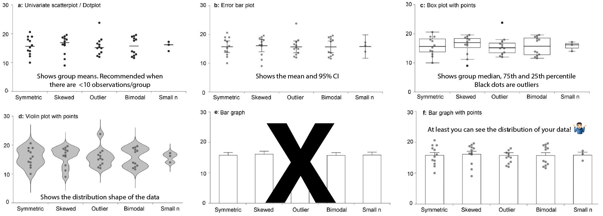

# Making publication ready figures with ggpubr

## Ahmet Bakirbas, Ph.D.

## 12/06/2024

## Before we start learning about the ggpubr package, let's remember a few key points about data visualization.

### 1. Different graphs emphasize different aspects of the data:



###### Modified from [Weissgerber et al. (2017)](https://www.jbc.org/article/S0021-9258(20)32792-7/fulltext)

### 2. Why you should not use a bar graph:

{style="margin-left:auto; margin-right:auto"}

### 3. Don't conceal your data:


###### Modified from [Matejka & Fitzmaurice (2017)](https://www.research.autodesk.com/publications/same-stats-different-graphs/)

#### - Seven distributions of data, shown as raw data points (of strip-plots), as box plots, and as violin plots.

#### - Box-plots are commonly used to show the distribution of a dataset, and are better than simply showing the mean or median value. However, here we can see as the distribution of points changes, the box-plot remains static.

#### - Violin plots are good for presenting distribution of your data with more detail than it is available with a box plot.

### 4. Allow your PI/colleagues/readers to evaluate your data effectively:

{style="margin-left:auto; margin-right:auto"}

###### Modified from [Weissgerber et al. (2019)](https://www.ahajournals.org/doi/10.1161/CIRCULATIONAHA.118.037777?url_ver=Z39.88-2003)

#### - Jittering is useful when you have a discrete position and a relatively small number of points.

#### - **Do not use** jitter when the exact location of a mark is important to the analysis.

### ggplot2 is a popular data visualization package developed by Hadley Wickham for programming langugage R

#### You can create highly customizable plots using ggplot2 package


### [Grammar of ggplot2]{.underline}

#### ggplot function accepts two arguments

##### - Dataset to be plotted (data.frame format)

##### - Aesthetic mappings provided by aes function

#### Additional parameters such as geometric objects (e.g. points, lines, bars) are passed on by appending them with + as separator.

#### Geoms: a layer combines data, aes, a geom (geometric object), a stat (statistical transformation), and a position adjustment. Typically, you will create layers using a geom\_ function, overriding the default position and stat if needed.


### Let's familiarize ourselves with ggplot2 grammar:

```{r setup, include = FALSE, cache= TRUE}
options(repos = list(CRAN="http://cran.rstudio.com/"))
knitr::opts_chunk$set(message = FALSE, warning = FALSE)
# The pacman package is an R package management tool that we will use to load multiple packages we will need

if (!require(pacman)) {
    install.packages("pacman")
    require(pacman)
}
# p_load function allows us to load one or more packages as a more generic substitute for the 'library' or 'require' functions and if the package isn't available locally it will install it for us

pacman::p_load(tidyverse, readr, ggpubr, ggsci, RTCGA, RTCGA.clinical, RTCGA.mRNA, try.bioconductor = TRUE)
# tidyverse will load the core tidyverse packages: ggplot2, for data visualization. dplyr, for data manipulation. tidyr, for data tidying.
# We will use readr package to read the data via its read_csv function
# ggpubr will be utilized for generating publication ready figures
# ggsci offers a collection of high-quality color palettes inspired by colors used in scientific journals, data visualization libraries, sci-fi movies, and even your favorite TV shows!
# RTCGA package enables us to download and use The Cancer Genome Atlas (TCGA) dataset, particularly the clinical and mRNA gene expression data packages will be used today
```

```{r}
# We are using data from the National Morbidity and Mortality Air Pollution Study (NMMAPS).
# To make the plots manageable we are limiting the data to Chicago and 1997-2000.
chicago <- readr::read_csv("https://cedricscherer.com/data/chicago-nmmaps-custom.csv")

#list top 10 rows
head(chicago, 10)
```

```{r}
ggplot(chicago, aes(x = date, y = temp))

# Hmm, only a white panel? Why? This is because {ggplot2} does not know how we want to plot that data! Do we want a line plot, a scatter plot or something else?
```

```{r}
ggplot(chicago, aes(x = date, y = temp)) + geom_point()

# This gives us a simple scatter plot but let's get more creative in the next example

```

```{r}
# Let's customize our plot by adding a title, subtitle, caption, tag and changing the title of our legend

ggplot(chicago, aes(x = date, y = temp, color = season)) +
  geom_point() +
  labs(x = "Year", y = "Temperature (?F)",
       color = "Seasons",
       title = "Temperatures in Chicago",
       subtitle = "Seasonal pattern of daily temperatures from 1997 to 2001",
       caption = "Data: NMMAPS",
       tag = "Fig. 1")+
  theme_classic() # classic and simple theme
```

### Create publication ready plots with ggpubr

#### - ggplot2 package is excellent and flexible for elegant data visualization in R.

#### - However the default generated plots requires some formatting before they can be used in publications.

#### The function expressionsTCGA() from the RTCGA package can be used to extract the expression values of genes of interest in one or multiple cancer types.

#### In the following code chunk, we will extract the mRNA expression for five genes of interest - GATA3, PTEN, XBP1, ESR1 and MUC1 - from 3 different data sets:

##### - Breast invasive carcinoma (BRCA),

##### - Ovarian serous cystadenocarcinoma (OV)

##### - Lung squamous cell carcinoma (LUSC)

```{r}
expr <- expressionsTCGA(BRCA.mRNA, OV.mRNA, LUSC.mRNA, extract.cols = c("GATA3", "PTEN", "XBP1","ESR1", "MUC1"))

# We can simplify data set names by removing the ".mRNA" tag. This can be done using the R base function gsub().

expr$dataset <- gsub(pattern = ".mRNA", replacement = "",  expr$dataset)

my_comparisons <- list(c("BRCA", "OV"), c("OV", "LUSC")) # add the comparisons you want to make

# ggboxplot function creates a box plot. Here we are using the expression data from the TCGA package. We are telling the function to use expression values for GATA3 gene from different cancer types (Dataset column forming the x axis) while filling data points based on cancer type (dataset column) based on the color palette of New England Journal of Medicine (NEJM) that we obtain through ggsci package.

ggboxplot(expr, x = "dataset", y = "GATA3", title = "GATA3", ylab = "Expression", fill = "dataset", palette = "nejm")+ stat_compare_means(comparisons = my_comparisons)
```

### Instead of repeating the same R code for each gene, you can create a list of plots at once, as follow:

```{r}
# Create a  list of plots

my_comparisons <- list(c("BRCA", "OV"), c("OV", "LUSC"))
p <- ggboxplot(expr, x = "dataset", 
               y = c("GATA3", "PTEN", "XBP1"),
               title = c("GATA3", "PTEN", "XBP1"),
               ylab = "Expression", 
               fill = "dataset", palette = "nejm")
# View GATA3
p$GATA3+
  stat_compare_means(comparisons = my_comparisons)
# View PTEN
p$PTEN+
  stat_compare_means(comparisons = my_comparisons)
# View XBP1
p$XBP1+
  stat_compare_means(comparisons = my_comparisons)
```

#### Please note that when the argument y contains multiple variables (in this case multiple gene names), then the other arguments such as title, xlab and ylab can be also a character vector of same length as y.

### You can merge the 3 plots using the argument **merge = TRUE**:

```{r}
ggviolin(expr, x = "dataset",
          y = c("GATA3", "PTEN", "XBP1"),
          merge = TRUE,
          ylab = "Expression",
          palette = "igv",
         add = c("dotplot", "jitter"),
         add.params = list(size = 0.9, binwidth = 0.08, alpha = 0.2))

# use add.params argument to add parameters (color, alpha, size, binwidth) for the argument 'add'
```

### To combine the three gene expression plots into a multi-panel plot, use the argument **combine = TRUE**:

```{r}
# Let's try to make a first draft figure to show your colleague or your PI

my_comparisons <- list(c("BRCA", "OV"), c("OV", "LUSC"))
boxp <- ggboxplot(expr, x = "dataset",
          y = c("GATA3", "PTEN", "XBP1"),
          combine = TRUE,
          ylab = "Expression",
          fill = "dataset", palette = "nejm")+
  stat_compare_means(comparisons = my_comparisons, label = "p.signif", method="t.test")

ggpar(boxp, ylim = c(-8,8)) # Let's change the y-axis limits using ggpar function of ggpubr to make the significance test results fit better
```
